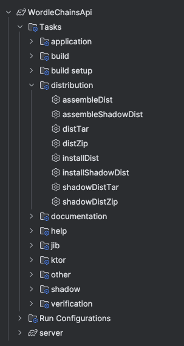
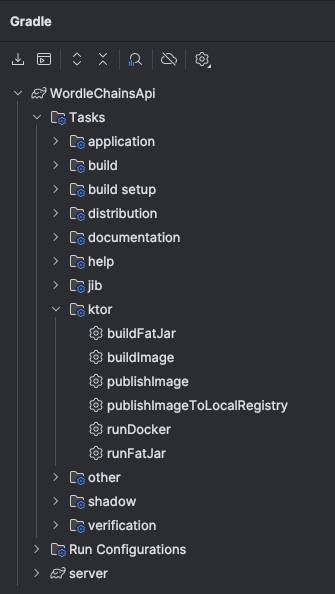
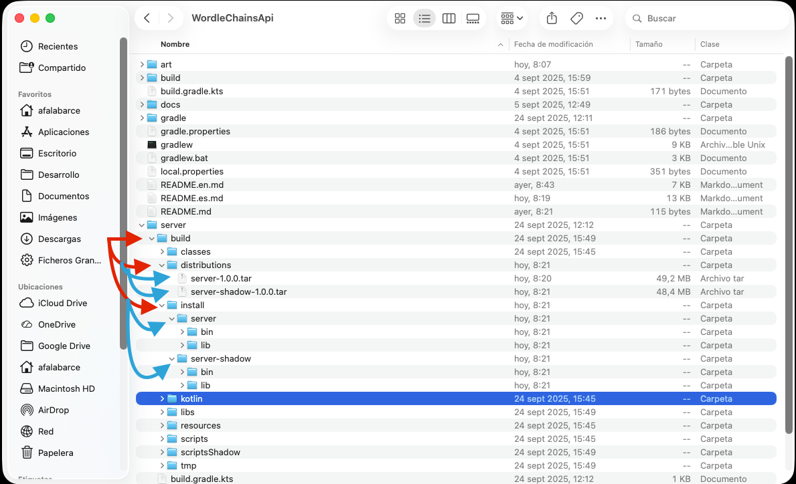
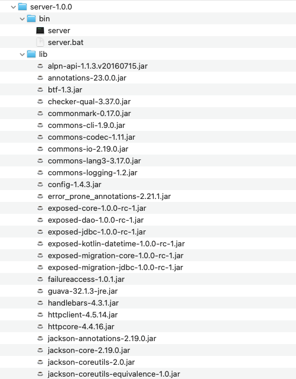
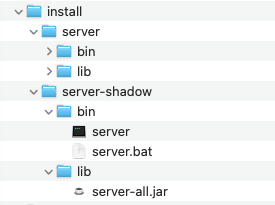
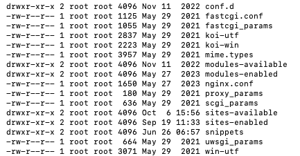
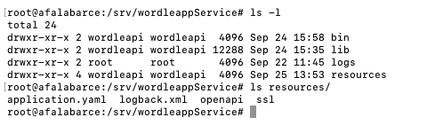

md
# Wordle Chains API

## Introduction

This project implements a REST API example developed with the [Kotlin](https://kotlinlang.org/) programming language and the [Ktor](https://ktor.io/) framework, aimed at being used for the implementation of a Wordle-style word game.

In the following paragraphs and sections, we will describe both how the implementation was carried out and its deployment on a production server (along with the corresponding challenges).

## Technologies Used

For the development of this service, various technologies have been used that greatly facilitate its development and subsequent deployment. Let's list them:

- Programming Language: Kotlin
- ReST Service Engine: Ktor Server
- Visual Testing Engine: [Swagger](https://swagger.io/) + [OpenAPI](https://www.openapis.org/)
- Database Engine: [PostgreSQL](https://www.postgresql.org)
- ORM (Object-Relational Mapper): [Jetbrains Exposed](https://www.jetbrains.com/exposed/)
- Web Server: [nginx](https://nginx.org/)
- Dependency Injection: Not necessary, database access is managed through extension functions.

## Architecture

This project is based on an [MVC (Model-View-Controller)](https://en.wikipedia.org/wiki/Model%E2%80%93view%E2%80%93controller) architecture, which is usually one of the most common in the development of ReST services.

The entire project is distributed into three main packages:
- **common**: Where we host extension functions and the definition of plugins used by Ktor (authentication, routing, serialization, etc.).
- **database**: where the database structure is defined, attending to the particularities in the definition of types and DAOs of Exposed.
- **controllers**: Where we define the controllers that will define the endpoints that the ReST service will expose.

There is a special folder called **resources** where the different configuration parameters of the service are stored:
- **application.yaml**: contains the execution parameters for the service.
- **openapi folder**: contains the YAML files used by Swagger to display and generate the classic web interface with which we can test our service.

## Layers (common, database, controllers)

In this section, we will describe in detail the how and why of the decisions made when carrying out the implementation.

### common

In this layer, we define everything necessary that will represent and be part of the service's core. We have it all divided into three files:
- **Extensions.kt**: Extension functions are implemented here to provide clarity to the code, for example, a date validator and a decryption function.
- **PluginsInstall.kt**: In this file, we define the different plugins that will be activated in Ktor, so that our service has the desired functionality.<br/>
  For this, a couple of methods are defined with the objective of separating functionality, as one depends on the database engine (through Exposed) having made a successful connection.<br/>
  It is worth highlighting the authentication system, defined by the Authentication plugin, which shows how to perform a custom authentication where the authentication token is encrypted (thus, we ensure that if we provide a public key to an external developer, they can encrypt the token; otherwise, that encryption will be invalid, and therefore the authenticated part cannot be used).
- **RoutingConfig.kt**: In this file, we define all the routes that the service will expose, according to the communication protocol, as well as establishing an authenticated zone, which will only provide data or execute insertions in the DB if a valid authentication token is present. This file also exposes a single method that, dependent on the successful initialization of the database, will expose the routing tables.

### database

In this layer, all that is required for CRUD access to the database is managed.
As mentioned in the introduction, the entire process of connecting, extracting, and updating data has been done using the Jetbrains Exposed ORM, which provides relative simplicity along with power.

This layer is organized into two main layers:

- **common**: Where we implement the database connection through the configurations in [resources/application.yaml](server/src/main/resources/application.yaml), as well as a method that guarantees that all database transactions are performed in a coroutine.
- **features**: In this layer, we implement the definitions of the Exposed tables and their DAOs for each feature. While the goal of this README is not to be an Exposed tutorial, we will show an example involving a master-detail entity (perhaps one of the most complex aspects).<br/>
  Let's look at both the files that define the tables and the mappers that will be used to map the data from/to the entities exposed in the controllers:
```kotlin
object ExposedDailyGame: IntIdTable(
    name = "daily_game",
    columnName = "daily_id"
){
    val date = long(name = "date")
    val language = varchar(name = "language", length = 10)
}

class DailyGameDao(id: EntityID<Int>): IntEntity(id){
    companion object : IntEntityClass<DailyGameDao>(ExposedDailyGame)
    var date by ExposedDailyGame.date
    var language by ExposedDailyGame.language
    val words: SizedIterable<DailyGameWordDao> by DailyGameWordDao referrersOn ExposedDailyGameWord.dailyId

}
```
```kotlin
object ExposedDailyGameWord: IntIdTable(
    name = "daily_game_words",
    columnName = "daily_game_word_id"
) {
    val dailyId = reference(name = "daily_id", refColumn = ExposedDailyGame.id)
    val wordId = reference("word_id", refColumn = ExposedWord.id)
    val linkedWordId = reference("linked_word_id", refColumn = ExposedWord.id).nullable()
    val linkingPosition = integer(name = "linking_position").nullable()
    val linkedWordPosition = integer(name = "linked_word_position").nullable()

    init {
        foreignKey(
            dailyId to ExposedDailyGame.id,
            wordId to ExposedWord.id,
            linkedWordId to ExposedWord.id
        )
    }
}

class DailyGameWordDao(id: EntityID<Int>): IntEntity(id){
    companion object : IntEntityClass<DailyGameWordDao>(ExposedDailyGameWord)
    var dailyId by ExposedDailyGameWord.dailyId
    var word: WordDao by WordDao referencedOn ExposedDailyGameWord.wordId
    var linkedWord by ExposedDailyGameWord.linkedWordId
    var linkingPosition by ExposedDailyGameWord.linkingPosition
    var linkedWordPosition by ExposedDailyGameWord.linkedWordPosition
}
```
As we can see, we have two entities, the master (ExposedDailyGame) and the one that loads its detail 
(ExposedDailyGameWord), which, as we can appreciate, is related to the first through a one-to-many relationship, 
ensuring that a word, based on this relationship, can only be repeated once in a daily game.

If we look closely, an Exposed configuration for a database consists of two parts:
- The logical definition of the table (which will "coincide" with the database representation).
- The DAO, which will be the one that implements the CRUD logic, as well as the mapping of data from a record, including 
the automatic loading of the related data.

### controllers

In this layer, again organizing everything by features to maintain coherence, the code is organized as follows:

- **models** folder: in this folder, we define the domain models, i.e., the data classes that will be emitted when a request is made to us. This folder has nothing special.
- **repository** folder: In which we will implement the repositories from which we will obtain the information from the database and map it against domain entities. </br>

As an example, we will show a repository where complex entities are loaded (following the same example from the **database** section).<br/>
```kotlin
suspend fun Database.getDailyGame(date: LocalDate, language: String): DailyGame? = suspendTransaction {
    DailyGameDao.find {
        ExposedDailyGame.date eq date.toEpochDays() and(
            ExposedDailyGame.language eq language
        )
    }.firstOrNull()?.let(::dailyGameDaoToModel)
}
```

Let's look at the data extraction. As we can see, we use the DAO defined in the database, from which we use the *find* extension function, which allows us to query information by applying filters in a relatively simple way. As we can see from its syntax, in the `find` lambda, we define the search method, applying both infix functions (`eq`, `not eq`, etc.) and non-infix functions like `and` (`or` and similar), which itself encapsulates the additional criteria to be applied. Finally, if data has been obtained, the mapping is executed (in the `let` block).

The code above will internally generate several SQL statements to load all the necessary data into the entities. Broadly speaking (and I am probably missing some), the statements generated will be as follows:

```sql
select dg.* from daily_game 
where date=:date and language=:language

select dgw.* from daily_game_words dgw
inner join daily_game dg on dg.daily_id=dgw.daily_id
where dg.date=:date and dg.language=:language

select w.* from words w
inner join daily_game_words dgw on dgw.word_id=w.id
inner join daily_game dg on dg.daily_id=dgw.daily_id
where dg.date=:date and dg.language=:language

select w.* from words w
inner join daily_game_words dgw on dgw.linked_word_id=w.id
inner join daily_game dg on dg.daily_id=dgw.daily_id
where dg.date=:date and dg.language=:language
```

- **Controller.kt** file: This file is responsible for executing the requests made to the service. 

As can be seen in the following code, we create each controller by extending it from `RoutingCall` 
to simplify the routing configuration. Continuing with the previous examples, we show the controller that extracts the `dailygame` information:

```kotlin
suspend fun RoutingCall.getDailyGame(database: Database){
    val dailyGame = this.parameters["dailyGame"]
    val language = this.parameters["language"]

    if (dailyGame.isValidDate() && language.orEmpty().isNotEmpty()) {
        val localDate: LocalDate = LocalDate.parse(dailyGame!!)
        val dailyGame = database.getDailyGame(localDate, language!!)
        if (dailyGame != null)
            respond(dailyGame)
        else
            respond(status = HttpStatusCode.NotFound, "Daily game not found")
    }else {
        this.respond(status = HttpStatusCode.BadRequest, "Invalid date format")
    }
}
```

Why did we implement it this way? We just need to have a look at how we've defined the routes 
in our [RoutingConfig.kt](server/src/main/kotlin/dev/afalabarce/wordlechains/api/common/RoutingConfig.kt):

```kotlin
authenticate {
    get(path = "/v1/dailyGame/{dailyGame}/{language}") {
        call.getDailyGame(database)
    }

    post(path = "/v1/hallOfFame") {

        call.updateHallOfFame(database)
    }
}
```

We have also taken the opportunity to show how to integrate requests into an authenticated block, meaning 
that requests within `authenticate` automatically require authentication. If we do not issue a token via 
the `Authorization` header, a 401 (Unauthorized) error will be automatically issued.

If we look closely, we can see that when configuring the route, we pass the parameters using `{ }` in its definition. 
There are other methods for defining routes using safe types; for more information, refer to the Ktor documentation.

## Deployment

The deployment of the service we have created is relatively "simple," however, we must be careful 
with some important aspects.

The project provides us with a series of Gradle tasks that will greatly facilitate the distribution process. 
For this, we just need to look at the task tree, specifically in the **distribution** section:





For information on using the different tasks, the information is available on the [Ktor documentation site](https://ktor.io/docs/welcome.html).

For our example, we have used the **distTar** task, as `tar` is a standard on any Unix-like system (macOS, Linux, BSD,...).

The result after executing the task is as follows (red and blue arrows):



If we look, the necessary tar/zip files are created in the distributions folder, whether they are zips, normal tars, 
or shadow tars (ultimately a fatjar with everything inside). The result is the same... the creation of a folder with 
an ordered structure (**BUT INCOMPLETE FOR OUR NEEDS**) and ready for deployment on a server.

For example, upon decompressing the generated tar file (named in the format `<project_name>-<project_version>.tar`), we get the following:



On the other hand, the content after decompressing the shadow tar (named in the format `<project_name>-shadow-<project_version>.tar`) is as follows:



As we can see in each screenshot, the structure is substantially different, since, while with a normal distribution 
everything is separated into the different libraries (those external to the project are completely independent), 
in a shadow distribution, everything is included in the same jar.

Each distribution philosophy has its pros and cons:

A shadow jar is heavier for a small update, but we guarantee that we are not missing anything in case we add new dependencies. 
On the other hand, such a large jar can pose a performance problem if it grows significantly. As we can deduce, the pros and 
cons of a normal installation are the opposite; if we have an update, we only need to update the `server-1.0.0.jar` and little else.

### Real-world use case. Deployment on a Linux server

This service is available at the URL [https://wordleapi.afalabarce.dev](https://wordleapi.afalabarce.dev) with its corresponding Swagger for testing.

This service is hosted on a machine with the following general characteristics:

- Operating System: Debian Linux.
- JDK: Minimum version 21.
- Web Server: nginx.
- Database Engine: PostgreSql

In the following sections, we will show how the project was deployed, including the problems encountered and the solutions adopted.

#### Linux operating system

There is not much to tell at this point, as it is a standard installation of the operating system. Just keep in mind that in a DNS service, 
the necessary entries must be defined to support the different services that the server may offer, such as webmail, 
the REST API itself, other REST APIs, etc.

Defining different DNS names for the server will help us make our web service more efficient, as we will be 
able to atomize, simplify, and isolate one service from another quite a bit.

We will create a user who will be responsible for running the service, without privileges, to avoid possible security problems. 
This user will have as their home the folder we choose to house the service, thus making permission management simpler.

Once the generated tar is loaded onto our server, we will unpack it in the path we deem necessary, 
for example, and to be organized, in `/srv/wordleappService`.

Once unzipped, we must configure our service to run at the start of the operating system. Linux provides us with a 
"simple" method to perform this task, which we must carry out as `root`. Let's see it step by step:

- **We create the folder and decompress the tar**. There is not much to explain; for example, we will create the folder in `/srv/wordleappService`.
- **Location of the service's "executable"**. In the newly created folder, we will see that we have **a file named `server` in the `bin` folder**. 
This file is the one that will run our service and expose the port configured in `application.yaml`.
- We will create a file for the service. Since Debian supports [systemd](https://systemd.io/) for running system services, we will use it. To do this:
  - We move to the `/etc/systemd/system` folder.
  - We create a new file called `wordleapi.service` (for example, using `nano`, `pico`, `vi`, or the text editor we are most comfortable with). 
  And we add the following content:

```bash
[Unit]
Description=WordleApiService
After=network.target

[Service]
User=wordleapi
WorkingDirectory=/srv/wordleappService/
ExecStart=/srv/wordleappService/bin/server
Restart=always
RestartSec=3

[Install]
WantedBy=default.target
```

- Enable the service in systemd. We will run the command: `systemctl enable wordleapi`
- Start the service so that it is available and listens on the port defined in the configuration. 
We will run the following command: `systemctl start wordleapi`

#### Web Server: nginx

We have opted to deploy the service using nginx, which we believe is a standard today in both performance and security. 
We must remember that nginx IS NOT a web server in the traditional sense (like [Apache](https://httpd.apache.org/)) but is 
understood as a web proxy, more focused on encapsulating any type of project that exposes a port, encapsulating security, SSL, etc.

nginx is a great option for deploying Ktor-based services since our service runs directly by exposing a port. 
In our case, and for security reasons, only a specific non-standard port is exposed to localhost, so access to 
said port and its configuration is absolutely restricted, leaving the responsibility of communication from the outside to nginx. 
Using SSL communication ensures the encryption of the communication and offloads that burden and responsibility from the service.

Each site in nginx is based on the configuration of files that will encapsulate the access configuration for each site.



For our specific case, let's look at the nginx configuration for our service (located in the `sites-available` folder):

```bash
server {
        listen 80;
        server_name wordleapi.afalabarce.dev;
        return 301 https://$server_name$request_uri;
}
server {

        # SSL configuration
        #
        listen 443;
        
        server_name wordleapi.afalabarce.dev;
        large_client_header_buffers 4 32k;
        client_max_body_size 50M;
        charset utf-8;

        access_log /srv/wordleappService/logs/nginx.access.log;
        error_log /srv/wordleappService/logs/nginx.error.log;

        # TLS: Configure your TLS following the best practices inside your company
    # Other configurations

    # API
    location /v1 {
        proxy_set_header Host $http_host;
        proxy_set_header X-Real-IP $remote_addr;
        proxy_set_header X-Scheme $scheme;
        proxy_set_header X-Forwarded-Proto $scheme;
        proxy_set_header X-Forwarded-For $proxy_add_x_forwarded_for;
        proxy_pass http://127.0.0.1:8085/v1;
        proxy_redirect off;
    }

    # swagger
    location / {
        proxy_set_header Host $http_host;
        proxy_set_header X-Real-IP $remote_addr;
        proxy_set_header X-Scheme $scheme;
        proxy_set_header X-Forwarded-Proto $scheme;
        proxy_set_header X-Forwarded-For $proxy_add_x_forwarded_for;
        proxy_pass http://127.0.0.1:8085/swagger;
        proxy_redirect off;
    }

    location /swagger {
        proxy_set_header Host $http_host;
        proxy_set_header X-Real-IP $remote_addr;
        proxy_set_header X-Scheme $scheme;
        proxy_set_header X-Forwarded-Proto $scheme;
        proxy_set_header X-Forwarded-For $proxy_add_x_forwarded_for;
        proxy_pass http://127.0.0.1:8085/swagger;
        proxy_redirect off;
    }
}

```

As we can see, we route both the API access and the Swagger access directly,
using `location`. We also force a redirect in case a non-secure call is used.
This way, that port 8085 is not exposed to the general public.

Based on the above configuration, we see that we must create a `logs` folder, as otherwise,
we won't know what is happening (and it will also give us an error when starting the nginx service).

Once the file in `sites-available` is configured, we just need to activate it in the `sites-enabled` folder,
creating a symbolic link as follows:

```bash
sites-enabled # ln -s ../sites-available/wordlechainsapi wordlechainsapi
```

Once nginx is configured, and the service is launched (process indicated in the previous step), we only need 
to restart nginx, for which we will run the following command: `systemctl restart nginx`.

If we have configured everything correctly, the service will be available and no error will be indicated on the console. 
In case there is any configuration error in the site files, we can see what the error is by running `journalctl`, 
some information in the [following thread](https://unix.stackexchange.com/questions/225401/how-to-see-full-log-from-systemctl-status-service).

With all this, we would have our service deployed, but as we will see when we test it, 
it won't work as we expect since there are things that "are not there".

## Problems Encountered

### Service Execution

When we develop on our local machine, we might have a database with less security than what we might 
have on our server (for example, without a password). And upon deployment, we realize that we have forgotten 
to configure the corresponding parameters. So, we look for the `resources` folder where we have our `application.yaml`...

But we realize that we only have the `bin` and `lib` folders, but there is no `resources` folder.

This is the first problem we encounter. We try to solve it by creating the `resources` folder and copying 
into it the same files we have in our project: `application.yaml`, the `openapi` folder, and so on.



With this, we might think that we have solved everything. Again, we restart the service (both the Wordle API and nginx) 
using the console command `systemctl restart wordleapy && systemctl restart nginx`, but we notice that it 
is still failing even though we have configured everything as in the development environment...

**what is happening?**

The problem is that when the Gradle task we use to generate the tar, the zip, or whatever, 
**it encapsulates the configuration files from our machine inside the `server-1.0.0.jar`**, 
preventing the service from launching and using the resources on our production server.

**how did we solve this problem?**

We solved the problem in a simple and pragmatic way by observing the characteristics 
of the server process that is launched.

Let's look at the content of the script that runs the service (in the `bin/server` folder). 
If we edit and analyze it, we will see that at the end, the call to the jar is launched... 
and looking at the Ktor documentation, we see that a specific parameter can be passed that will solve our problems... 
The parameter in question is **-config**... which allows us to indicate an alternative location for 
the service's configuration file.

So, we will locate the following line in the `server` file in the `bin` folder (it is the last one, or it should be):

```bash
exec "$JAVACMD" "$@"
```

and we will modify it as follows:

```bash
exec "$JAVACMD" "$@" "-config=$APP_HOME/resources/application.yaml"
```

Next, we save the changes and again, restart the service with the command
`systemctl restart wordleapy && systemctl restart nginx`

### Swagger / openapi

Another problem, related to the previous one, is with Swagger, which has a similar
issue... it is unable to feed from the `resources` data (in a standard configuration),
as they are in the jar, causing errors. In our service, we have opted to add an extra parameter in `Application.yaml`
indicating the physical path of the `openapi` folder. This way, in the code (we can
see it in `RouteConfig.kt`), we will force it to directly take the data to correctly render the
Swagger page.

The major problem found with Swagger / OpenAPI is that if we do not have an Ultimate license for
[Intellij Idea](https://www.jetbrains.com/idea/), we do not have the possibility of generating the documentation
automatically. Therefore, **we must generate the `documentation.yaml` file (in `resources/openapi/`)
by hand**. While this is not complicated, since Android Studio is capable of auto-completing the parameters
we need relatively well, it is necessary to have a basic understanding of how both
YAML syntax and the structure required by OpenAPI work (which can be overcome with OpenAPI's own documentation,
as well as by relying on AI agents).

## Final Conclusion

In my case, I had always opted for the development of REST services using [.net core](https://learn.microsoft.com/es-es/aspnet/core/overview?view=aspnetcore-9.0),
but after trying Ktor with Kotlin, I believe that today Ktor has
little or nothing to envy of the framework
created by Microsoft.

It is simple, and if we need to create a multiplatform project, we could even
reuse the business logic, writing less code.

I think this small project can shed a lot of light (with its flaws, which will be many) and be useful
for any developer who is considering making the leap to creating their own REST services
using this technology.
